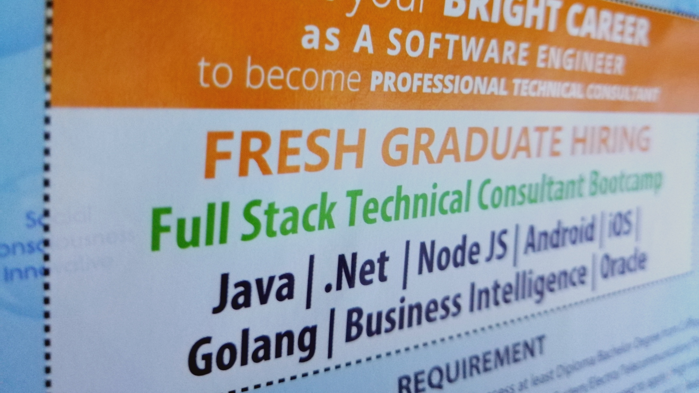
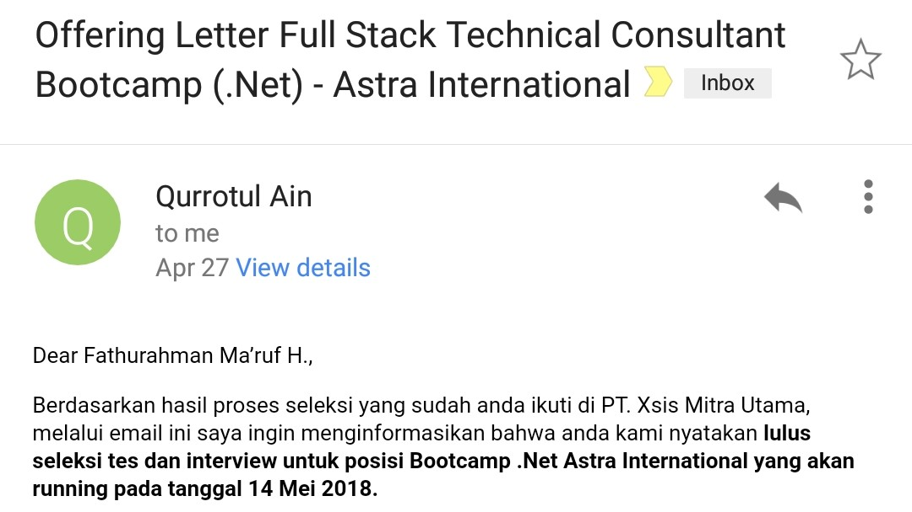

*Hari ini adalah hari pertama gue melakukan aktivitas baru yaitu mempelajari bahasa pemrograman C# di [PT. Xsis Mitra Utama][xs] melalui bootcamp .Net Developer dari [Xsis Academy][xa].*

<!--more-->

**Sebelumnya, hari Kamis 19 April 2018**\
Gue dan dua temen gue dateng ke event Career Days atau biasa disebut job fair di [Telkom University][tu], setelah melihat-lihat kesana-kemari, gue tertarik pada banner yang bertuliskan *Full Stack Technical Consultant Bootcamp* yang terpampang di booth [Xsis][xs]. Lalu gue hampiri dan menanyakan beberapa hal mengenai bootcamp ini.

<!--  -->

**Gue tertarik!**\
Selama kegiatan bootcamp berlangsung, peserta bootcamp bakal dapet uang saku, uang makan, dan tunjangan tempat tinggal. Menurut gue sih lumayan, lu dapet ilmu gratis dan lu dibayar. Akhirnya gue bilang ke mbak-nya bahwa gue akan ikut tes seleksi yang dilaksanakan pada tanggal 24 April 2018 di [Telkom University][tu].

**Selasa, 24 April 2018**\
Hari seleksi pun tiba, seleksi ini dimulai pukul 08.30 WIB yang diawali dengan mengisi formulir dimulai dari biodata, alasan mengikuti seleksi ini, dan ketersediaan ditempatkan di perusahaan client di Jakarta.
Kemudian pada tahap psikotes, gue udah yakin bakal lolos karena gue sering melakukan tes ini pada saat masih SMA, yah walaupun gue engga tau score gue saat ini berapa.

Tes selanjutnya adalah tes teknikal, tes ini dibedakan menjadi dua yaitu untuk lulusan dengan latar belakang IT dan non-IT. Gue yang merupakan lulusan dengan latar belakang IT dapet soal-soal mengenai pemrograman dimulai dari logika pemrograman, bahasa query, dan bahasa html.

Sebelum istirahat shalat dan makan, diumumkan ada empat peserta dari 73 peserta yang tidak bisa mengikuti ke tahap selanjutnya.

Setelah istirahat selesai, ada tes teknikal tambahan dari PT. Astra Internasional, karena seleksi ini merupakan partnership project [PT. Xsis Mitra Utama][xs] dengan PT. Astra Internasional. Ada dua jenis tes, tes pemrograman mengenai Object Oriented Programming dan tes logika.

**Interview**\
Tahap interview dilakukan paling tidak sebanyak dua kali dan maksimal empat kali. Kok banyak banget? Gue juga engga tau, perkiraan gue sih ada tiga interview user dari Astra (.Net, JAVA, dan Business Intelligence) dan interview HRD dari [Xsis][xs]. Pastinya gue cuma dua kali interview.

Saat interview user, gue ditanya mengenai pengalaman pemrograman dan paradigma OOP. Kemudian gue ditanya mau masuk kelas mana kalo keterima, dan gue jawab, kelas mana aja Pak bebas hehe.

Interview HRD hanya membahas mengenai kekurangan, kelebihan diri, gaji, dan ketersediaan bekerja di Jakarta serta pengumuman hasil seleksi yang diinformasikan melalui email paling cepet tiga hari setelah proses seleksi.

**Jum'at, 27 April 2018**

Pada hari Jum'at gue dapet email dari ibu Qurrotul Ain yang biasa dipanggil ibu Qory mengenai kelulusan hasil seleksi, dan gue diterima di kelas Bootcamp .Net.

**Hari ini, Senin, 14 Mei 2018**\
Sebelum masuk ke kelas .Net, seluruh peserta bootcamp berada di satu ruangan kelas yang sama untuk merayakan pembukaan kelas bootcamp .Net, JAVA, dan Business Intelligence yang disebut *Kick-off Meeting* untuk memperkenalkan diri masing-masing dan sambutan dari Manajer [Xsis Academy][xa].

Setelah itu, kami peserta bootcamp .Net batch 152 masuk ke ruangan yang bernama *Energetic*, ya, setiap ruangan memiliki nama yang merupakan nilai-nilai dari [Xsis][xs] itu sendiri.

Hari pertama, kami mempelajari GUI Microsoft Visual Studio, karena pemrograman .Net ini menggunakan IDE Visual Studio walaupun belum masuk ke materi .Net. Materi yang diajarkan dari hari pertama sampai minggu kedua adalah mengenai basic syntax bahasa C#.

[xs]: https://www.xsis.co.id "PT. Xsis Mitra Utama"
[xa]: https://xsis.academy "Xsis Academy"
[tu]: https://www.telkomuniversity.ac.id "Telkom University"
